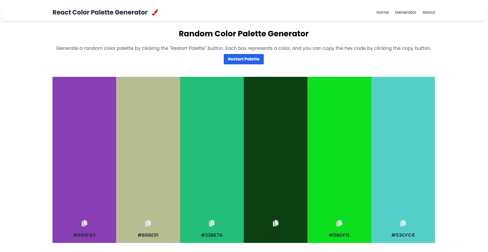

# Random Color Palette Generator

This project is a simple React-based color palette generator that creates random color palettes. Users can click the "Restart Palette" button to generate a new set of colors. Each color box displays a randomly generated color, and users can copy the corresponding hex code by clicking the copy button.

## Features

- Generate random color palettes with a single click.
- Copy hex codes of colors for easy use in other applications or designs.
- Simple and intuitive user interface.

## Technologies Used

- React: A JavaScript library for building user interfaces.
- Tailwind CSS: A utility-first CSS framework for building custom designs quickly.

## Getting Started

To run this project locally, follow these steps:

1. Clone this repository:

```bash
git clone https://github.com/f0rsakeN-afk/colorPaletteGenerator
```
2. Navigate to the project directory

```bash
cd colorPaletteGenerator
```

 3. Install dependencies
 ```bash
npm install
 ```

4. Start the development server
```bash
npm run dev
```

## Screenshots


## Contributing
Contributions are welcome! If you find any bugs or have suggestions for improvements, please feel free to open an issue or submit a pull request.